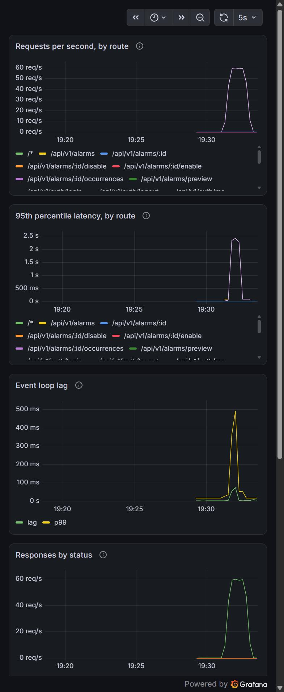

# Load testing — first run

**Date:** 5 October 2026
**Target:** local instance, Node 24, PostgreSQL 18, one process
**Tool:** k6 v2.3.0
**Configuration:** `LIST_DELAY_MS=0`, so the deliberate 600 ms skeleton delay (A-01)
does not dominate the measurements. It is a testability feature, not latency.

## Results

| Profile | Virtual users | Requests | Failures | p95 | Max |
| --- | --- | --- | --- | --- | --- |
| Smoke | 1 | 1,309 | 0% | 29 ms | 101 ms |
| Load (mixed) | 20 | 1,448 | **0.75%** | 68–106 ms | **50.2 s** |
| Stress (preview only) | 100 | 84,285 | 0% | 188 ms | 4.1 s |
| Auth (sign-in only) | 20 | 6,523 | 0% | 236 ms | 1.3 s |
| Load, re-run after the pool change | 20 | 2,838 | 0.35% | 123–138 ms | **1m40s** |
| Spike (one endpoint, 5 → 100 → 5) | 100 | 5,243 | **0%** | 1.72 s | 1.94 s |

## What the numbers say

**Computation is not the bottleneck.** The stress profile drove
`POST /alarms/preview` to 100 concurrent users and 495 requests a second with
no failures at all and a 188 ms p95. That endpoint runs the recurrence engine
over a weekday schedule repeating every fifteen minutes — real work — and it
scales cleanly.

**Something outside the application is.** The mixed load profile, at a fifth
of the stress profile's concurrency, produced 50-second maximums on three
separate endpoints and 0.75% outright failures. The difference between the two
profiles is not how hard the work is; it is that **preview never touches the
database** while `GET /alarms`, `GET /me/upcoming` and
`GET /folders/{id}/conflicts` all do.

That pointed at the connection pool, which is created with `max: 10` and no
acquisition timeout, and this document said so. **That diagnosis was wrong**,
and the correction is worth more than the original claim was.

Three experiments disproved it. Raising `max` from 10 to 40 changed nothing.
Adding `connectionTimeoutMillis: 5000`, which should have turned a 50-second
hang into a 5-second error, changed nothing — the re-run's maximum went *up*,
to 1m40s. And comparing the client's numbers against the application's own
request log settled it. During the re-run, across **6,959 responses the
application logged**:

| Server-measured response time | Count |
| --- | --- |
| under 100 ms | 6,591 |
| 100 ms – 1 s | 357 |
| 1 s – 5 s | **0** |
| 5 s – 30 s | 11 |
| over 30 s | **0** |

The application never took longer than about ten seconds for anything, and
never once took between one and five seconds — while k6 was measuring 1m40s.
A request the server believes it answered in thirty milliseconds did not spend
a hundred seconds in request handling.

The eleven slow responses cluster at **exactly 10,070 ms**. The same
exact-ten-second signature turned up independently while automating the
browser specs: a `GET /auth/me` timing out at 10,000 ms carrying valid
cookies, a `click` hanging 10,000 ms after Playwright reported the element
visible, enabled and stable, and a `/health` taking 10,011 ms while event-loop
lag sat at 2 ms. Some requests report a duration of 0 s, which is a connection
that never completed rather than a slow one.

Idle event loop, 10–20% CPU across 20 cores, no server-side slowness, stalls
landing on 10-second boundaries: a timeout-and-retry on the connection path,
not a queue in the application. This is a machine whose TLS interception has
already broken two package managers in this project. That is a direction and
not a conclusion, and it is recorded as one in
[DEF-08](../../docs/defects/#def-08).

**What this run is actually worth.** Not the finding it thought it had. The
method: a client-side measurement alone cannot distinguish "the application is
slow" from "something between the client and the application is slow." Three
independent measurements — the client's timings, the server's own request log,
and the event loop — separated them, and only the second one was decisive. A
load test that reports a number without a second source has told you where to
look, not what you found.

**Authentication has a separate ceiling.** 81 requests a second against
`POST /auth/login`, versus 495 for preview — roughly six times the cost per
request. Passwords are hashed with scrypt, which is memory-hard by design and
runs on Node's libuv thread pool, four threads by default. This is not a
defect; it is the point of the algorithm. It is worth knowing because
concurrent sign-ins occupy that pool and slow requests that have nothing to do
with authentication, which is exactly how it was first noticed: the browser
suite signed in once per test and the whole application slowed down.

## Findings

| # | Finding | Severity | Status |
| --- | --- | --- | --- |
| 1 | Database-backed endpoints show multi-second maxima under modest concurrency. Reproducible; cause not in the application's request handling. | Medium | Open — see DEF-08 |
| 2 | 0.35–0.75% of requests fail at 20 virtual users. Never inspected: the scripts do not capture failing response bodies. | Medium | Open |
| 3 | The pool had no acquisition timeout. A latent hazard, now bounded — but not the cause of finding 1. | Low | Hardened |
| 4 | Authentication throughput is bounded by scrypt on a four-thread pool. By design. | Informational | Documented |

Finding 2 is the gap that matters next, and it is a gap in **these scripts**
rather than in the application. A failure rate with no captured response body
is a number that cannot be acted on, and it is the one piece of evidence that
might have shortened the path to the correction above.

## Not covered yet

- **Soak.** Nothing here runs long enough to show a leak. The candidates are
  known: the speech audio cache in PostgreSQL has no eviction at all, the
  notification scheduler holds a timer map, and the rate limiter keeps
  in-memory windows keyed by address.
- ~~**Spike recovery.**~~ Run, with monitoring attached. See below.
- ~~**Prometheus and Grafana.**~~ Running, natively rather than in a
  container. See [`k6/observability/native/`](../observability/native/).

## Reproducing

```bash
# In the application repository
cd src/api && TEST_SUPPORT=1 LIST_DELAY_MS=0 node dist/boot.js
```

```bash
# Here
k6 run k6/smoke.js     # one user, proves the script
k6 run k6/load.js      # 20 users, mixed, normal load
k6 run k6/stress.js    # steps to 100, finds the knee
k6 run k6/spike.js     # sudden jump, tests recovery
k6 run k6/auth.js      # sign-in throughput on purpose
```

## The spike, watched

`spike.js` had never been run. It models the hour turning, when every open tab
polls at once: five users, then a hundred within five seconds, held for twenty,
then back to five. The question a spike test asks is not whether it is slow
during the surge — it will be — but whether it **recovers**, or stays degraded
because a queue built up that never drains.

It recovered. 5,243 requests, **zero failures**, p95 1.72 s, maximum 1.94 s.



| Measurement | Peak | After |
| --- | --- | --- |
| Requests per second | 60.2 | 23.4 |
| 95th percentile latency | 2.411 s | 0.092 s |
| **Event loop lag, p99** | **0.364 s** | 0.017 s |

**Read the third row against DEF-08.** Here the event loop lag rose
twenty-two-fold and came back: the process was genuinely busy, which is the
correct and expected answer to a hundred concurrent users. In the mixed load
profile, requests took a hundred seconds while that same number stayed at
**2 ms**.

Two failures with near-identical request timings and completely different
causes, told apart by one panel. A load test that measures only from the
client cannot make that distinction, which is the entire argument for
instrumenting the thing being tested rather than only timing it from outside.

One more thing this run says about DEF-08: a hundred virtual users on a single
database-backed endpoint were fine. Twenty, spread across four endpoints, were
not. Concurrency alone is not the variable.
